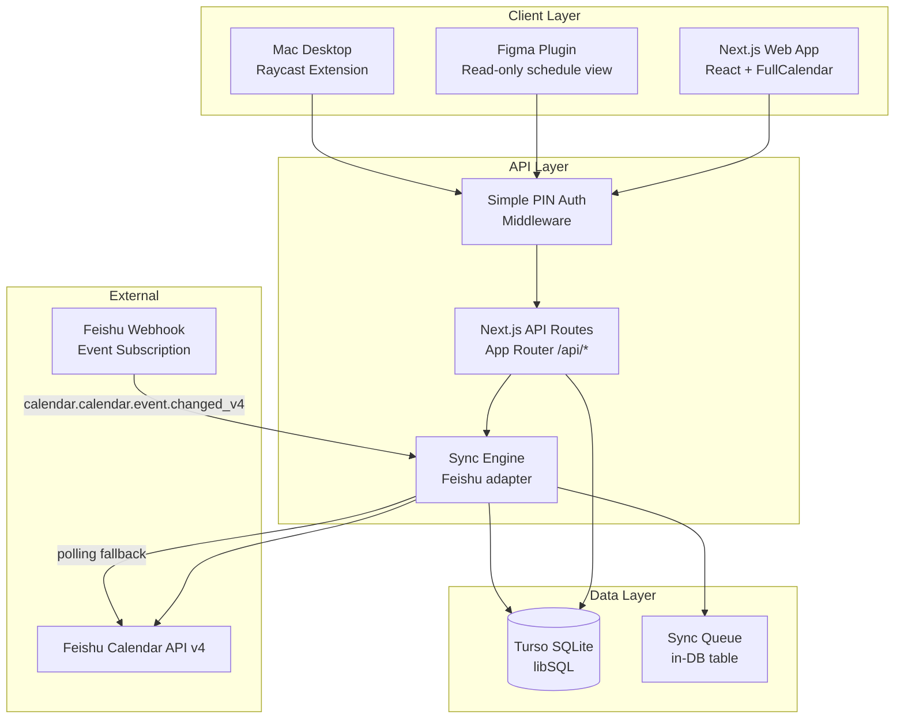
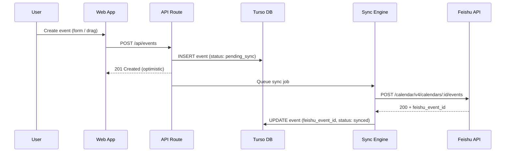
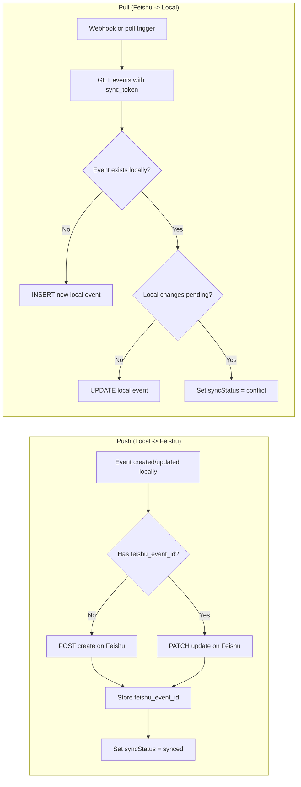
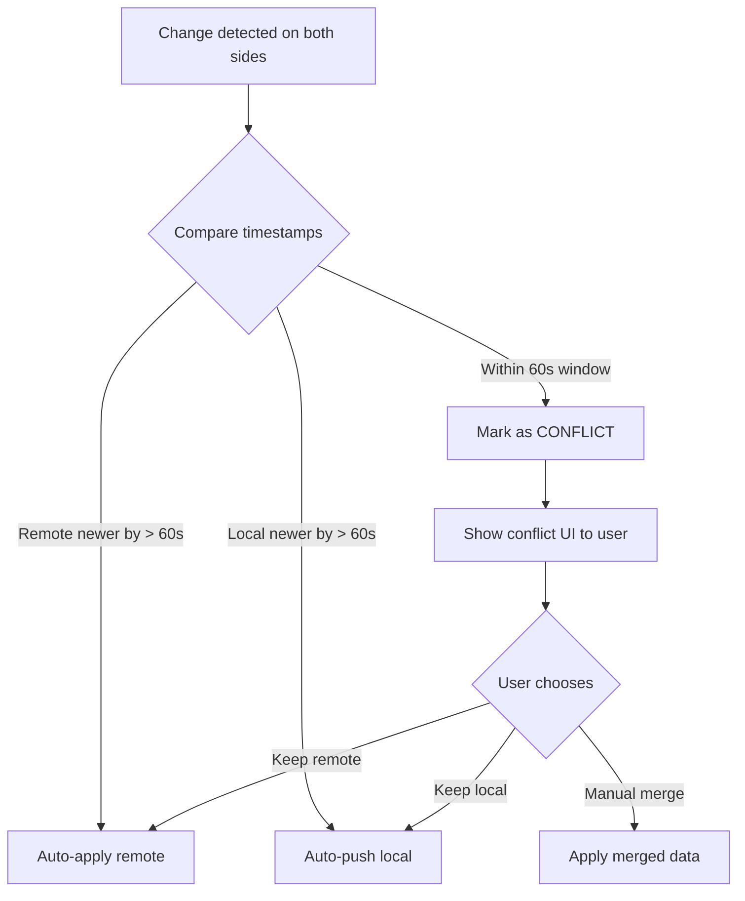
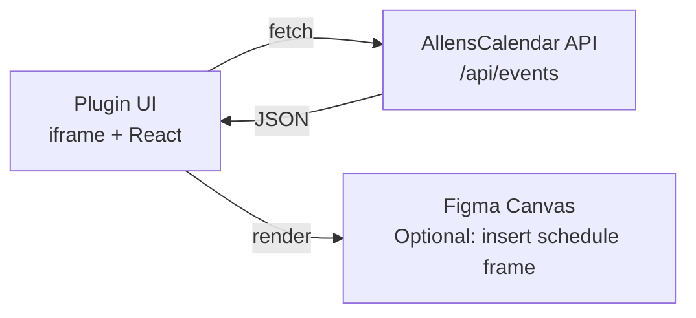
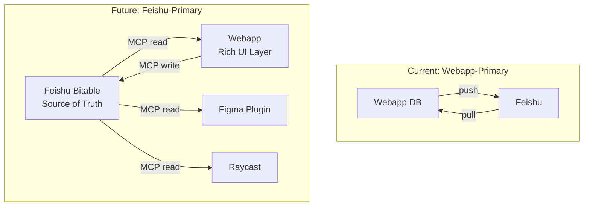

# AllensCalendar

A production-schedule calendar webapp for film/video production workflows, with bidirectional Feishu sync, a Figma plugin for in-tool visibility, and Mac desktop access via Raycast.

Built for Allen — a production lead who needs to plan shoots, track post-production, and work backwards from planned social media posting dates.

---

## Table of Contents

- [Project Overview](#project-overview)
- [Architecture](#architecture)
- [Data Model](#data-model)
- [Design System](#design-system)
- [Features (Prioritized)](#features-prioritized)
- [API Design](#api-design)
- [Authentication](#authentication)
- [Sync Architecture: Feishu Bidirectional Sync](#sync-architecture-feishu-bidirectional-sync)
- [Figma Plugin](#figma-plugin)
- [Mac Desktop Options](#mac-desktop-options)
- [Tech Stack](#tech-stack)
- [Project Structure](#project-structure)
- [Deployment](#deployment)
- [Environment Variables](#environment-variables)
- [Feishu Setup Guide](#feishu-setup-guide)
- [Future Roadmap](#future-roadmap)
- [Contributing / Agent Guide](#contributing--agent-guide)

---

## Project Overview

### What

A calendar webapp purpose-built for **film/video production scheduling**. Events carry production-specific metadata (duration, key person, content type, custom categories) rather than generic calendar fields. The core workflow is **working backwards from social media posting dates** — Allen sets a planned post date, then the app helps visualize the production timeline (shoot, edit, review, delivery) leading up to it.

The app syncs bidirectionally with Feishu Calendar so the schedule lives where the team already works.

### Why

Generic calendar tools (Google Calendar, Feishu Calendar alone) lack structured production metadata. Allen needs to see *what* is being produced, *who* owns it, *how long* it takes, and *what category* it falls into — all at a glance on a calendar. This app adds that structure while keeping Feishu as the team's communication and scheduling hub.

### Who

- **Primary user**: Allen — production lead / content creator (single-user for MVP)
- **Future users**: Collaborators via Feishu, designers via Figma plugin

---

## Architecture

### System Diagram



### Data Flow: Event Creation



### Source of Truth Strategy

**The webapp is the primary source of truth** for production metadata (content type, category, production duration, key person). Feishu is the source of truth for scheduling conflicts, attendees, and meeting rooms. The sync engine merges both:

| Field | Source of Truth | Reason |
|---|---|---|
| `title` | Webapp | May differ from Feishu summary |
| `date`, `startTime`, `endTime` | **Last-write-wins** | Either side can reschedule |
| `productionDuration` | Webapp | Not a Feishu concept |
| `keyPerson` | Webapp | Maps to Feishu attendee but enriched |
| `content` | Webapp | Custom enum, no Feishu equivalent |
| `category` | Webapp | Custom taxonomy |
| `attendees` | Feishu | Feishu manages RSVPs |
| `location`, `vchat` | Feishu | Feishu manages rooms/links |

---

## Data Model

### Full Schema

```typescript
// ============================================================
// Core Event
// ============================================================
interface CalendarEvent {
  id: string;                    // ULID (sortable, no collisions)
  title: string;                 // Required. Production name.
  description?: string;          // Optional. Markdown-supported.

  // Scheduling
  date: string;                  // ISO 8601 date: "2026-04-15"
  startTime?: string;            // ISO 8601 datetime (optional for all-day)
  endTime?: string;              // ISO 8601 datetime
  allDay: boolean;               // Default: true

  // Production metadata
  productionDuration: number;    // In hours. 0 = unestimated.
  productionDurationUnit: 'hours' | 'days'; // Display preference
  keyPerson: string;             // Owner / responsible person
  content: 'settings' | 'models'; // Content type enum
  category: string;              // FK to Category.slug

  // Sync metadata
  feishuEventId?: string;        // Feishu calendar event ID
  feishuCalendarId?: string;     // Feishu calendar ID
  syncStatus: SyncStatus;
  localUpdatedAt: string;        // ISO 8601 datetime with tz
  remoteUpdatedAt?: string;      // Last known Feishu updated_at
  syncError?: string;            // Last sync error message

  // Housekeeping
  createdAt: string;
  updatedAt: string;
  deletedAt?: string;            // Soft delete
}

type SyncStatus =
  | 'local_only'       // Created locally, never synced
  | 'pending_sync'     // Local change awaiting push to Feishu
  | 'synced'           // In sync with Feishu
  | 'pending_pull'     // Feishu change awaiting local apply
  | 'conflict'         // Both sides changed since last sync
  | 'error';           // Sync failed

// ============================================================
// Category
// ============================================================
interface Category {
  id: string;
  slug: string;                  // URL-safe identifier
  name: string;                  // Display name
  color: string;                 // Hex color for calendar display
  sortOrder: number;
  createdAt: string;
}

// ============================================================
// Sync Log (audit trail)
// ============================================================
interface SyncLog {
  id: string;
  eventId: string;
  direction: 'push' | 'pull';
  status: 'success' | 'failure' | 'conflict_resolved';
  details?: string;              // JSON blob of what changed
  resolvedBy?: 'local' | 'remote' | 'manual';
  createdAt: string;
}

// ============================================================
// Sync Cursor (tracks incremental sync position)
// ============================================================
interface SyncCursor {
  id: string;
  calendarId: string;            // Feishu calendar ID
  syncToken: string;             // Feishu sync_token for incremental list
  lastSyncAt: string;
}
```

### Drizzle ORM Schema (SQLite)

```typescript
// src/db/schema.ts
import { sqliteTable, text, integer, real } from 'drizzle-orm/sqlite-core';
import { ulid } from 'ulid';

export const events = sqliteTable('events', {
  id: text('id').primaryKey().$defaultFn(() => ulid()),
  title: text('title').notNull(),
  description: text('description'),
  date: text('date').notNull(),               // ISO date
  startTime: text('start_time'),
  endTime: text('end_time'),
  allDay: integer('all_day', { mode: 'boolean' }).notNull().default(true),
  productionDuration: real('production_duration').notNull().default(0),
  productionDurationUnit: text('production_duration_unit', {
    enum: ['hours', 'days']
  }).notNull().default('hours'),
  keyPerson: text('key_person').notNull(),
  content: text('content', { enum: ['settings', 'models'] }).notNull(),
  category: text('category').notNull(),
  feishuEventId: text('feishu_event_id'),
  feishuCalendarId: text('feishu_calendar_id'),
  syncStatus: text('sync_status', {
    enum: ['local_only', 'pending_sync', 'synced', 'pending_pull', 'conflict', 'error']
  }).notNull().default('local_only'),
  localUpdatedAt: text('local_updated_at').notNull(),
  remoteUpdatedAt: text('remote_updated_at'),
  syncError: text('sync_error'),
  createdAt: text('created_at').notNull().$defaultFn(() => new Date().toISOString()),
  updatedAt: text('updated_at').notNull().$defaultFn(() => new Date().toISOString()),
  deletedAt: text('deleted_at'),
});

export const categories = sqliteTable('categories', {
  id: text('id').primaryKey().$defaultFn(() => ulid()),
  slug: text('slug').notNull().unique(),
  name: text('name').notNull(),
  color: text('color').notNull().default('#FEF991'),
  sortOrder: integer('sort_order').notNull().default(0),
  createdAt: text('created_at').notNull().$defaultFn(() => new Date().toISOString()),
});

export const syncLogs = sqliteTable('sync_logs', {
  id: text('id').primaryKey().$defaultFn(() => ulid()),
  eventId: text('event_id').notNull().references(() => events.id),
  direction: text('direction', { enum: ['push', 'pull'] }).notNull(),
  status: text('status', {
    enum: ['success', 'failure', 'conflict_resolved']
  }).notNull(),
  details: text('details'),
  resolvedBy: text('resolved_by', { enum: ['local', 'remote', 'manual'] }),
  createdAt: text('created_at').notNull().$defaultFn(() => new Date().toISOString()),
});

export const syncCursors = sqliteTable('sync_cursors', {
  id: text('id').primaryKey().$defaultFn(() => ulid()),
  calendarId: text('calendar_id').notNull().unique(),
  syncToken: text('sync_token').notNull(),
  lastSyncAt: text('last_sync_at').notNull(),
});
```

---

## Design System

The UI follows **Even Realities brand guidelines** (Design Library 3.0).

### Color Palette

| Token | Hex | Usage |
|-------|-----|-------|
| **ER-Black** | `#222222` | Primary text, headers |
| **ER-White** | `#FFFFFF` | Backgrounds |
| **Brand Yellow** | `#FEF991` | Accent, hover states, today indicator |
| Neutral-850 | `#171717` | Dark mode surface |
| Neutral-800 | `#232323` | Dark mode card background |
| Neutral-750 | `#2E2E2E` | Dark mode elevated surface |
| Neutral-700 | `#3E3E3E` | Borders (dark mode) |
| Neutral-200 | `#E5E5E5` | Borders (light mode) |
| Neutral-100 | `#F2F2F2` | Light mode card background |
| Signal Red | `#FF453A` | Errors, overdue events, delete actions |
| Signal Yellow | `#FFCF54` | Warnings, pending sync |
| Signal Green | `#4BB956` | Success, synced status |
| Signal Blue | `#4B7EB9` | Info, links |

### Typography

| Style | Font | Size | Weight | Letter Spacing |
|-------|------|------|--------|---------------|
| Title - Large | FK Grotesk Neue | 32px | Regular (400) | -1.28px |
| Title - Medium | FK Grotesk Neue | 28px | Regular (400) | -1.12px |
| Title - Small | FK Grotesk Neue | 24px | Regular (400) | -0.96px |
| Body - Large | FK Grotesk Neue | 16px | Regular (400) | -0.48px |
| Body - Medium | FK Grotesk Neue | 15px | Regular (400) | -0.45px |
| Body - Small | FK Grotesk Neue | 13px | Regular (400) | -0.26px |
| Label - Large | FK Grotesk Neue | 12px | Regular (400) | 0.0 |
| Label - Medium | FK Grotesk Neue | 11px | Regular (400) | 0.0 |

**Key rules:**
- Negative letter spacing throughout (tight tracking) — brand signature
- FK Grotesk Neue Light (300) for body text, Regular (400) for titles/emphasis
- Fallback stack: `'FK Grotesk Neue', 'Source Han Sans SC', -apple-system, sans-serif`
- CJK support via Source Han Sans SC (if Allen's team uses Chinese)

### Tailwind Config

```typescript
// tailwind.config.ts (partial)
{
  theme: {
    extend: {
      colors: {
        'er-black': '#222222',
        'er-white': '#FFFFFF',
        'brand-yellow': '#FEF991',
        'signal-red': '#FF453A',
        'signal-yellow': '#FFCF54',
        'signal-green': '#4BB956',
        'signal-blue': '#4B7EB9',
        neutral: {
          850: '#171717',
          800: '#232323',
          750: '#2E2E2E',
          700: '#3E3E3E',
          600: '#595959',
          500: '#737373',
          400: '#999999',
          300: '#BDBDBD',
          250: '#D3D3D3',
          200: '#E5E5E5',
          100: '#F2F2F2',
        },
      },
      fontFamily: {
        sans: ['FK Grotesk Neue', 'Source Han Sans SC', '-apple-system', 'sans-serif'],
      },
      letterSpacing: {
        'tight-brand': '-0.04em',  // Brand standard ~-4% tracking
      },
    },
  },
}
```

### Category Colors (Default Seeds)

| Category | Color | Hex |
|----------|-------|-----|
| Photoshoot | Brand Yellow | `#FEF991` |
| Video | Signal Blue | `#4B7EB9` |
| Post-Production | Purple | `#8B5CF6` |
| Review | Signal Yellow | `#FFCF54` |
| Delivery | Signal Green | `#4BB956` |
| Social Post | Signal Red | `#FF453A` |

### Elevation

3-tier shadow system matching Even Design Library 3.0:
- **Low**: Subtle shadow for cards and list items
- **Medium**: Modals and dropdowns
- **High**: Popovers and notifications

---

## Features (Prioritized)

### P0 — Must Have (MVP)

| # | Feature | Acceptance Criteria |
|---|---------|-------------------|
| 1 | **Calendar month/week/day views** | Switch between month, week, and day views. Current date highlighted with Brand Yellow. Navigation arrows for prev/next. |
| 2 | **Create event** | Modal form with all schema fields. Validation on required fields. Event appears on calendar immediately. |
| 3 | **Read events** | Events render on the correct date with category color coding. Click to open detail view. |
| 4 | **Update event** | Click event to open edit modal. All fields editable. Save persists to DB. |
| 5 | **Delete event** | Delete button with confirmation dialog. Soft-delete (sets `deletedAt`). Event disappears from calendar. |
| 6 | **Drag and drop reschedule** | Drag an event to a new date/time slot. Drop updates `date`/`startTime`/`endTime`. Undo toast for 5 seconds. |
| 7 | **Category CRUD** | Settings page to create/edit/delete categories with name + color. Seeded defaults: Photoshoot, Video, Post-Production, Review, Delivery, Social Post. |
| 8 | **Simple PIN auth** | PIN/password entry screen on first visit. Stored hashed in DB. Cookie-based session. No signup flow — set PIN via env var or first-run setup. |
| 9 | **Responsive layout** | Works on desktop (primary) and tablet. Not optimized for phone but not broken. |

### P1 — Should Have (v1.1)

| # | Feature | Acceptance Criteria |
|---|---------|-------------------|
| 10 | **Feishu push sync** | Creating/updating/deleting an event in the webapp pushes the change to Feishu Calendar within 30 seconds. |
| 11 | **Feishu pull sync** | Changes in Feishu Calendar appear in the webapp within 5 minutes (webhook) or 15 minutes (polling fallback). |
| 12 | **Conflict resolution UI** | When `syncStatus = 'conflict'`, show a diff view with local vs remote values. User picks which version wins or merges manually. |
| 13 | **Sync status indicators** | Each event shows a subtle icon: synced (check), pending (spinner), error (warning), conflict (exclamation). |
| 14 | **Event search and filter** | Filter by category, key person, content type. Text search on title and description. |
| 15 | **Keyboard shortcuts** | `N` = new event, `E` = edit selected, `Delete` = delete selected, `T` = today, arrow keys = navigate dates. |
| 16 | **Production timeline view** | For a given post date, visualize the production pipeline backwards: Delivery -> Review -> Post-Production -> Shoot. Shows if the timeline is feasible. |

### P2 — Nice to Have (v2+)

| # | Feature | Acceptance Criteria |
|---|---------|-------------------|
| 17 | **Figma plugin** | Read-only schedule view in Figma. Filterable by category. Auto-refreshes every 5 minutes. |
| 18 | **Raycast extension** | Shows today's and upcoming events. Click to open webapp. Quick-add event form. |
| 19 | **Timeline/Gantt view** | Horizontal timeline showing production durations across days/weeks. Useful for capacity planning. |
| 20 | **Recurring events** | RFC 5545 recurrence rules. Maps to Feishu recurrence field. |
| 21 | **Multi-user with roles** | Viewer, Editor, Admin roles. Auth via Feishu OAuth or simple invite codes. |
| 22 | **Notifications** | Feishu bot sends reminders before production starts. Configurable lead time. |
| 23 | **Analytics dashboard** | Production hours per category/person per week/month. Utilization visualization. |

---

## API Design

Base path: `/api`

### Events

| Method | Path | Description | Request Body | Response |
|--------|------|-------------|-------------|----------|
| `GET` | `/api/events` | List events | Query: `start`, `end`, `category`, `keyPerson`, `content`, `search`, `page`, `limit` | `{ events: Event[], total: number, page: number }` |
| `GET` | `/api/events/:id` | Get single event | — | `{ event: Event }` |
| `POST` | `/api/events` | Create event | `Omit<Event, 'id' \| 'createdAt' \| 'updatedAt' \| 'syncStatus'>` | `{ event: Event }` (201) |
| `PATCH` | `/api/events/:id` | Update event | `Partial<Event>` | `{ event: Event }` |
| `PATCH` | `/api/events/:id/move` | Reschedule (drag) | `{ date, startTime?, endTime? }` | `{ event: Event }` |
| `DELETE` | `/api/events/:id` | Soft-delete event | — | `{ success: true }` |

### Categories

| Method | Path | Description |
|--------|------|-------------|
| `GET` | `/api/categories` | List all categories |
| `POST` | `/api/categories` | Create category |
| `PATCH` | `/api/categories/:id` | Update category |
| `DELETE` | `/api/categories/:id` | Delete category (fails if events exist) |

### Sync

| Method | Path | Description |
|--------|------|-------------|
| `POST` | `/api/sync/push` | Manually trigger push all pending events to Feishu |
| `POST` | `/api/sync/pull` | Manually trigger pull from Feishu |
| `GET` | `/api/sync/status` | Get sync health: last sync time, pending count, error count |
| `POST` | `/api/sync/resolve/:id` | Resolve a conflict: `{ resolution: 'local' \| 'remote' \| 'merge', mergedData?: Partial<Event> }` |
| `POST` | `/api/sync/webhook` | Feishu webhook receiver (POST from Feishu event subscription) |

### Auth

| Method | Path | Description |
|--------|------|-------------|
| `POST` | `/api/auth/verify` | Verify PIN, returns session cookie |
| `POST` | `/api/auth/logout` | Clear session cookie |
| `GET` | `/api/auth/status` | Check if current session is valid |

### Request/Response Conventions

- All timestamps: ISO 8601 with timezone
- All IDs: ULID strings
- Error shape: `{ error: string, code: string, details?: unknown }`
- Pagination: `?page=1&limit=50` (default limit 50, max 200)
- Soft-deleted events excluded by default; add `?includeDeleted=true` to include
- All endpoints except `/api/auth/*` and `/api/sync/webhook` require valid session cookie or API key

---

## Authentication

Simple PIN-based auth for single-user MVP. No user registration flow.

### How it Works

1. **First-time setup**: Set `AUTH_PIN` in environment variables (plaintext in `.env`, hashed at runtime)
2. **Login**: User enters PIN on the login screen. Server compares bcrypt hash. Sets an httpOnly cookie with a signed JWT (24h expiry)
3. **Session**: All API requests check the cookie. Invalid/expired sessions redirect to login
4. **API key**: For Figma plugin and Raycast extension, use the `API_KEY` env var as a Bearer token (simpler than cookie-based auth for external clients)

### Why Not More?

Allen is the only user. Adding OAuth, email auth, or Feishu SSO is overhead that doesn't help right now. When multi-user is needed (Phase 4), upgrade to Feishu OAuth — the app already has Feishu credentials configured.

---

## Sync Architecture: Feishu Bidirectional Sync

### Feishu API Endpoints Used

| Operation | Feishu Endpoint | Method |
|-----------|----------------|--------|
| List events | `/open-apis/calendar/v4/calendars/:calendar_id/events` | GET |
| Create event | `/open-apis/calendar/v4/calendars/:calendar_id/events` | POST |
| Update event | `/open-apis/calendar/v4/calendars/:calendar_id/events/:event_id` | PATCH |
| Delete event | `/open-apis/calendar/v4/calendars/:calendar_id/events/:event_id` | DELETE |
| Get primary calendar | `/open-apis/calendar/v4/calendars/primary` | POST |
| Subscribe to changes | `/open-apis/calendar/v4/calendars/:calendar_id/events/subscription` | POST |

### Authentication

Feishu uses OAuth 2.0. The app needs a **Feishu App** registered on the Open Platform:

1. Create app at `open.feishu.cn/app`
2. Add `calendar:calendar` and `calendar:calendar:readonly` scopes
3. Get `app_id` and `app_secret`
4. For user-level access: implement Feishu OAuth login flow to get `user_access_token`
5. For app-level access: use `tenant_access_token` (simpler for single-user)

**Recommendation for MVP**: Use `tenant_access_token` with the app added to Allen's Feishu workspace. This avoids OAuth flow complexity.

### Sync Flow



### Incremental Sync with sync_token

Feishu's event list endpoint supports `sync_token` for incremental sync:

1. **Initial sync**: Call `GET /events` without `sync_token`. Paginate through all results. When `has_more = false`, save the returned `sync_token` to `sync_cursors` table.
2. **Subsequent syncs**: Call `GET /events?sync_token=<saved_token>`. Returns only events changed since the last sync. Save the new `sync_token`.
3. **Important**: When using `sync_token`, do NOT pass `start_time` or `end_time` parameters.

### Conflict Resolution Strategy

**Default: Last-Write-Wins (LWW) with manual override for conflicts.**



**Field-level merge rules** (applied during auto-resolution):
- `title`: If different, prefer whichever side changed it (compare to last-synced snapshot)
- `date`/`time` fields: Last-write-wins by timestamp
- Production metadata (`productionDuration`, `keyPerson`, `content`, `category`): Always prefer local (Feishu doesn't have these fields)
- `description`: If both changed, flag for manual merge

### Webhook Setup

1. Register a webhook URL (`https://your-domain.com/api/sync/webhook`) on the Feishu app's event subscription configuration
2. Subscribe to event: `calendar.calendar.event.changed_v4`
3. Feishu sends a POST to the webhook when any calendar event changes
4. The webhook handler:
   - Verifies the request signature using the `Encrypt Key`
   - Triggers an incremental pull using `sync_token`
   - Returns `200 OK` immediately (processing is async)

### Polling Fallback

If the webhook is unreachable (e.g., local development), a polling cron runs every 15 minutes:

```typescript
// src/lib/sync/poll.ts
export async function pollFeishuChanges() {
  const cursor = await db.query.syncCursors.findFirst({
    where: eq(syncCursors.calendarId, FEISHU_CALENDAR_ID),
  });

  const response = await feishuClient.listEvents({
    calendarId: FEISHU_CALENDAR_ID,
    syncToken: cursor?.syncToken,
  });

  for (const event of response.events) {
    await reconcileEvent(event);
  }

  if (!response.hasMore && response.syncToken) {
    await db.update(syncCursors)
      .set({ syncToken: response.syncToken, lastSyncAt: new Date().toISOString() })
      .where(eq(syncCursors.calendarId, FEISHU_CALENDAR_ID));
  }
}
```

### Feishu Field Mapping

| Webapp Field | Feishu Event Field | Notes |
|---|---|---|
| `title` | `summary` | Direct map |
| `description` | `description` | Direct map |
| `date` + `startTime` | `start_time.timestamp` | Convert to Unix timestamp |
| `endTime` | `end_time.timestamp` | Convert to Unix timestamp |
| `allDay` | `start_time.date` / `end_time.date` | Use date-only fields for all-day events |
| `keyPerson` | First attendee or `description` prefix | Encode as `[Key: Allen]` in description if no attendee match |
| `productionDuration` | `description` suffix | Encode as `[Duration: 4h]` in description |
| `content` | `description` suffix | Encode as `[Content: settings]` |
| `category` | `color` (limited) or `description` suffix | Feishu has limited color options; encode in description |
| `id` | — | Not synced; mapped via `feishu_event_id` |

**Description encoding format** for production metadata in Feishu:

```
[actual description text]

---
[AllensCal:duration=4h,content=settings,category=photoshoot,keyPerson=Allen]
```

The sync engine parses this metadata block on pull and strips it for display. This avoids polluting the Feishu event description while preserving round-trip data.

---

## Figma Plugin

### Scope

A **read-only** Figma plugin that displays the production schedule inside Figma. Primary use case: designers and production team members glance at the schedule without leaving their design tool.

### Architecture



### Features

| Feature | Priority | Description |
|---------|----------|-------------|
| Weekly schedule view | P0 | Shows current + next week's events |
| Category color coding | P0 | Events colored by category |
| Filter by category/person | P1 | Dropdown filters |
| Auto-refresh | P1 | Poll API every 5 minutes |
| Insert as frame | P2 | Generate a styled Figma frame with the schedule for presentations |
| Status update | P2 | Click event to mark as "In Progress" / "Done" |

### Tech Stack

- **UI**: React + Figma Plugin API (iframe-based)
- **Build**: Vite + `create-figma-plugin`
- **API calls**: Fetch from the deployed webapp API (requires CORS configured for `figma.com` origin)
- **Auth**: API key passed as plugin setting (stored in `figma.clientStorage`)

### File Structure

```
packages/figma-plugin/
  src/
    ui/                # React UI rendered in iframe
      App.tsx
      components/
    code/              # Figma sandbox code
      main.ts
    shared/
      types.ts         # Shared types with main app
  manifest.json        # Figma plugin manifest
  vite.config.ts
```

---

## Mac Desktop Options

| Option | Approach | Pros | Cons | Effort | Recommendation |
|--------|----------|------|------|--------|----------------|
| **Raycast Extension** | TypeScript extension using Raycast API | Fastest to build. Native macOS feel. Searchable. Global hotkey. | Requires Raycast. Limited UI (list-based). No persistent visual. | 1-2 days | **Start here. Best effort-to-value.** |
| **macOS Menubar (Tauri)** | Rust + WebView menubar app | Always visible in menubar. Full custom UI. Tiny binary (~5MB). | Requires Rust toolchain. Code signing for Gatekeeper. | 1-2 weeks | Good v2 if Raycast isn't enough. |
| **macOS Menubar (Electron)** | Electron + React (shared with webapp) | Code sharing with webapp. Familiar tech. Rich UI. | Heavy (~100MB+). Memory hog. | 1 week | Avoid unless code sharing is critical. |
| **macOS Widget (WidgetKit)** | Swift + WidgetKit | Native widget. Beautiful iOS-like feel. | Requires Swift/Xcode. Apple review if distributed. | 1-2 weeks | Great UX but wrong tech stack. |
| **PWA with dock icon** | Install webapp as PWA via Chrome/Arc | Zero additional code. Works today. | No menubar presence. Just a browser tab. | 0 days | Free but underwhelming. |

### Raycast Extension Architecture

```
packages/raycast-extension/
  src/
    index.tsx           # Main command: show today's events
    upcoming.tsx        # Command: show upcoming week
    create-event.tsx    # Command: quick-add event form
    lib/
      api.ts            # Fetch from AllensCalendar API
      types.ts          # Shared types
  package.json          # Raycast extension manifest
```

The Raycast extension calls the same `/api/events` endpoints as the webapp. Authentication via API key stored in Raycast preferences.

---

## Tech Stack

### Core

| Layer | Choice | Rationale |
|-------|--------|-----------|
| **Framework** | Next.js 15 (App Router) | Vercel-native. Server components for fast loads. API routes for backend. Single deployable unit. |
| **Language** | TypeScript 5.x | Type safety across frontend, API, and sync engine. |
| **UI Library** | React 19 | Latest stable. Required by Next.js 15. |
| **Styling** | Tailwind CSS 4 + shadcn/ui | Utility-first. shadcn gives polished, accessible components. Even brand tokens in config. |
| **Calendar** | FullCalendar 6 (`@fullcalendar/react`) | Mature, battle-tested. Built-in month/week/day views. Native drag-and-drop. |
| **Drag & Drop** | FullCalendar built-in (`@fullcalendar/interaction`) | Event dragging and resizing out of the box. No separate dnd library needed. |
| **Database** | Turso (libSQL / SQLite) | Serverless-friendly. Generous free tier. Edge-replicated. Simple for single-user. |
| **ORM** | Drizzle ORM | Type-safe, lightweight, SQL-like syntax. Native Turso driver. |
| **Validation** | Zod | Runtime validation for API inputs. End-to-end type safety. |
| **Date handling** | date-fns | Tree-shakeable. FullCalendar compatible. |
| **Auth** | bcrypt + jose (JWT) | bcrypt for PIN hashing, jose for JWT session tokens. Lightweight, no auth framework needed. |

### Why Turso over Supabase/Postgres

- **Turso** is simpler (no connection pooling), cheaper (generous free tier), and faster (edge-replicated SQLite). The data model is straightforward.
- **Supabase** would be the right choice if we needed auth, real-time subscriptions, or row-level security. Those aren't MVP requirements.
- **Upgrade path**: Migrating Drizzle schemas from SQLite to Postgres is a one-line driver swap.

### Sync & Integration

| Component | Choice | Rationale |
|-----------|--------|-----------|
| **Feishu API client** | Custom thin wrapper over `fetch` | Feishu's API is RESTful. A thin wrapper with token refresh is cleaner than the full `@larksuiteoapi/node-sdk`. |
| **Token management** | `tenant_access_token` with auto-refresh | Token expires every 2 hours. Wrapper refreshes automatically. Stored in memory. |
| **Webhook verification** | Custom middleware using Feishu's `Encrypt Key` | Required for webhook security. |
| **Background jobs** | Vercel Cron + API routes | For polling fallback. No separate job queue. |

### Dev Tooling

| Tool | Purpose |
|------|---------|
| `pnpm` | Package manager (fast, strict, monorepo-friendly) |
| `turborepo` | Monorepo orchestration (webapp + figma plugin + raycast extension) |
| `eslint` + `prettier` | Linting and formatting |
| `vitest` | Unit/integration tests |
| `playwright` | E2E tests |
| `drizzle-kit` | Database migrations |

---

## Project Structure

```
allens-calendar/
  README.md                       # This file (PRD + setup guide)
  turbo.json                      # Turborepo config
  pnpm-workspace.yaml
  .env.example                    # Template for environment variables
  .github/
    workflows/
      ci.yml                      # Lint, test, type-check
      deploy.yml                  # Vercel deploy on main push

  packages/
    webapp/                       # Next.js application
      src/
        app/
          layout.tsx              # Root layout with providers
          page.tsx                # Calendar view (default)
          login/
            page.tsx              # PIN entry screen
          settings/
            page.tsx              # Categories management
          api/
            auth/
              verify/route.ts     # POST PIN verification
              logout/route.ts     # POST clear session
              status/route.ts     # GET session check
            events/
              route.ts            # GET (list), POST (create)
              [id]/
                route.ts          # GET, PATCH, DELETE
                move/
                  route.ts        # PATCH (drag-drop reschedule)
            categories/
              route.ts
              [id]/
                route.ts
            sync/
              push/route.ts
              pull/route.ts
              status/route.ts
              resolve/[id]/route.ts
              webhook/route.ts    # Feishu webhook receiver
        components/
          calendar/
            CalendarView.tsx      # FullCalendar wrapper
            EventModal.tsx        # Create/edit form
            EventCard.tsx         # Event display on calendar
            ConflictResolver.tsx  # Conflict diff + merge UI
          ui/                     # shadcn components
          layout/
            Header.tsx
            Sidebar.tsx
        lib/
          auth/
            pin.ts               # PIN hashing + verification
            session.ts           # JWT creation + validation
            middleware.ts         # Auth middleware for API routes
          db/
            index.ts             # Drizzle client + Turso connection
            schema.ts            # Drizzle schema (see Data Model)
            migrations/          # SQL migration files
            seed.ts              # Default categories
          sync/
            feishu-client.ts     # Feishu API wrapper
            push.ts              # Local -> Feishu sync logic
            pull.ts              # Feishu -> Local sync logic
            reconcile.ts         # Conflict detection + resolution
            field-mapping.ts     # Webapp <-> Feishu field transforms
            poll.ts              # Polling cron logic
          validators/
            event.ts             # Zod schemas for event CRUD
            category.ts
          utils/
            dates.ts             # date-fns helpers
        hooks/
          useEvents.ts           # SWR/React Query hook for events
          useCategories.ts
          useSyncStatus.ts
        styles/
          globals.css            # Tailwind base + FullCalendar overrides + Even brand fonts
        types/
          index.ts               # Shared TypeScript types

    figma-plugin/                 # Figma plugin (P2)
      src/
        ui/
        code/
        shared/
      manifest.json
      vite.config.ts
      package.json

    raycast-extension/            # Raycast extension (P2)
      src/
      package.json
```

---

## Deployment

### Local Development

```bash
# Prerequisites: Node.js 20+, pnpm 9+

# 1. Clone and install
git clone https://github.com/LesenmiaoYu/AllensCalendar.git
cd AllensCalendar
pnpm install

# 2. Set up environment variables
cp .env.example .env.local
# Edit .env.local with your values (see Environment Variables below)

# 3. Set up database
# Option A: Local SQLite file (no Turso account needed for dev)
# Set DATABASE_URL=file:local.db in .env.local
# Option B: Turso cloud
# turso db create allens-calendar
# turso db tokens create allens-calendar
# Set TURSO_DATABASE_URL and TURSO_AUTH_TOKEN in .env.local

# 4. Run migrations
pnpm --filter webapp db:migrate

# 5. Seed default categories
pnpm --filter webapp db:seed

# 6. Start dev server
pnpm --filter webapp dev
# App runs on http://localhost:3000
```

### Vercel Deployment

1. Connect the GitHub repo to Vercel
2. Set root directory to `packages/webapp`
3. Framework preset: Next.js
4. Add all environment variables from `.env.example`
5. Deploy

**Vercel Cron** for polling fallback:

```json
// packages/webapp/vercel.json
{
  "crons": [
    {
      "path": "/api/sync/pull",
      "schedule": "*/15 * * * *"
    }
  ]
}
```

### Database Setup (Turso)

```bash
# Install Turso CLI
brew install tursodatabase/tap/turso

# Authenticate
turso auth login

# Create database
turso db create allens-calendar

# Get connection URL
turso db show allens-calendar --url

# Create auth token
turso db tokens create allens-calendar

# Apply in .env.local or Vercel env vars:
# TURSO_DATABASE_URL=libsql://allens-calendar-<user>.turso.io
# TURSO_AUTH_TOKEN=<token>
```

---

## Environment Variables

```bash
# .env.example

# ============================================================
# Database (Turso)
# ============================================================
TURSO_DATABASE_URL=libsql://allens-calendar-<user>.turso.io
TURSO_AUTH_TOKEN=your-turso-auth-token

# For local dev with file-based SQLite:
# DATABASE_URL=file:local.db

# ============================================================
# Authentication
# ============================================================
# PIN for single-user access (will be hashed at runtime)
AUTH_PIN=your-pin-here
# Secret for signing JWT session tokens (generate with: openssl rand -hex 32)
JWT_SECRET=your-jwt-secret

# ============================================================
# Feishu / Lark Integration
# ============================================================
FEISHU_APP_ID=cli_xxxxxxxxxx
FEISHU_APP_SECRET=xxxxxxxxxxxxxxxxxxxxxxxx
FEISHU_CALENDAR_ID=xxxxxxxxxxxxxxxxxxxxxxxx
# Encrypt Key for webhook verification (set in Feishu app console)
FEISHU_ENCRYPT_KEY=xxxxxxxxxxxxxxxx
# Verification Token for webhook handshake
FEISHU_VERIFICATION_TOKEN=xxxxxxxxxxxxxxxx

# ============================================================
# App Config
# ============================================================
NEXT_PUBLIC_APP_URL=http://localhost:3000
# API key for Figma plugin and Raycast extension access
API_KEY=your-random-api-key

# ============================================================
# Vercel Cron Secret (protects cron endpoints)
# ============================================================
CRON_SECRET=your-cron-secret
```

---

## Feishu Setup Guide

Step-by-step instructions for Allen to set up Feishu Calendar sync.

### 1. Create a Feishu App

1. Go to [Feishu Open Platform](https://open.feishu.cn/app)
2. Click "Create Custom App"
3. Fill in app name: "AllensCalendar Sync"
4. Note the `App ID` and `App Secret`

### 2. Add Calendar Permissions

In the app console, go to **Permissions & Scopes** and add:

| Scope | Description |
|-------|-------------|
| `calendar:calendar` | Read and write calendar events |
| `calendar:calendar:readonly` | Read calendar data |

### 3. Enable Event Subscriptions

1. Go to **Event Subscriptions** in the app console
2. Set Request URL to: `https://your-domain.com/api/sync/webhook`
3. Set up Encrypt Key (save this — it goes in `FEISHU_ENCRYPT_KEY`)
4. Subscribe to event: `calendar.calendar.event.changed_v4`

### 4. Publish the App

1. Submit the app for review (internal apps are auto-approved in most orgs)
2. Once published, add the app to your Feishu workspace

### 5. Get Your Calendar ID

```bash
# Using the Feishu API to get your primary calendar ID:
curl -X POST 'https://open.feishu.cn/open-apis/calendar/v4/calendars/primary' \
  -H 'Authorization: Bearer <tenant_access_token>' \
  -H 'Content-Type: application/json'
```

The `calendar_id` in the response goes in `FEISHU_CALENDAR_ID`.

### 6. Get a tenant_access_token

```bash
curl -X POST 'https://open.feishu.cn/open-apis/auth/v3/tenant_access_token/internal' \
  -H 'Content-Type: application/json' \
  -d '{"app_id": "<your_app_id>", "app_secret": "<your_app_secret>"}'
```

The app handles token refresh automatically — you just need to set `FEISHU_APP_ID` and `FEISHU_APP_SECRET` in your env.

---

## Future Roadmap

### Phase 1: MVP (Weeks 1-3)

- Calendar webapp with full CRUD
- Drag-and-drop rescheduling
- Category management
- Simple PIN auth
- Deploy to Vercel

### Phase 2: Feishu Sync (Weeks 4-6)

- Push sync (local to Feishu)
- Pull sync with `sync_token`
- Webhook receiver
- Conflict resolution UI
- Sync status indicators

### Phase 3: Ecosystem (Weeks 7-10)

- Figma plugin (read-only schedule view)
- Raycast extension (quick view + quick add)
- Production timeline view (backwards from post dates)
- Analytics dashboard

### Phase 4: Scale (Weeks 11+)

- **Feishu MCP deep integration**: Use Feishu as a full data source/sink via MCP tools. Calendar events, linked documents (via `list-documents`, `get-document-content`), and task management all flow through a unified Feishu adapter.
- **Multi-user support**: Feishu OAuth login. Role-based access (viewer/editor/admin). Per-user calendar views.
- **Notifications**: Feishu bot messages for upcoming productions, overdue items, schedule conflicts.
- **Feishu Bitable integration**: Mirror the calendar to a Feishu Bitable (multi-dimensional table) for teams who prefer spreadsheet views.
- **Mobile**: PWA optimization for phone use on-set.
- **AI scheduling**: Suggest optimal scheduling based on key person availability, production dependencies, and historical duration data.

### Architecture Evolution for Feishu-First Future

The current architecture treats the webapp as the source of truth with Feishu as a sync target. If Feishu becomes the primary workspace, the architecture can evolve:



In the Feishu-primary model, the webapp becomes a presentation and interaction layer, with all data living in Feishu Bitable. The MCP tools become the data access layer — eliminating sync conflicts entirely since there's one source of truth.

**To prepare for this transition now**: Keep the data access layer abstract. All DB reads/writes go through a repository pattern (`src/lib/repositories/events.ts`) so the underlying store can be swapped from Turso to Feishu Bitable without touching UI or API code.

---

## Contributing / Agent Guide

This section is for developers and AI agents (Claude Code, Codex, Cursor, etc.) picking up this project.

### Conventions

| Convention | Rule |
|-----------|------|
| **Language** | TypeScript everywhere. No `any` types. Strict mode. |
| **Naming** | `camelCase` for variables/functions, `PascalCase` for components/types, `kebab-case` for files and routes. |
| **Components** | One component per file. Co-locate styles and tests. Use `shadcn/ui` primitives. |
| **API routes** | Use Next.js App Router route handlers. Validate inputs with Zod. Return typed responses. |
| **Database** | All schema changes via Drizzle migrations (`pnpm db:generate` then `pnpm db:migrate`). Never modify the DB directly. |
| **Sync** | All Feishu interactions go through `src/lib/sync/feishu-client.ts`. Never call Feishu API directly from components or API routes. |
| **Error handling** | API routes return `{ error, code }` with appropriate HTTP status. Use `NextResponse.json()`. |
| **Dates** | Store as ISO 8601 strings. Use `date-fns` for manipulation. Never use `new Date()` without timezone awareness. |
| **IDs** | ULIDs via `ulid` package. Never auto-increment integers. |
| **Design** | Follow Even Realities brand tokens defined in `tailwind.config.ts`. Use brand colors, not arbitrary values. |

### How to Add a New Feature

1. **Schema change?** Edit `src/lib/db/schema.ts`, run `pnpm db:generate`, review migration SQL, run `pnpm db:migrate`.
2. **API endpoint?** Add route handler in `src/app/api/`. Add Zod validator in `src/lib/validators/`. Add tests.
3. **UI component?** Create in `src/components/`. Use shadcn primitives with Even brand tokens. Add to the page that needs it.
4. **Feishu sync change?** Update `field-mapping.ts` for new fields. Update `push.ts` and `pull.ts` if the sync logic changes.

### How to Extend the Sync Engine

The sync engine is modular by design:

```
src/lib/sync/
  feishu-client.ts    # Low-level Feishu API wrapper (token refresh, request/response)
  field-mapping.ts    # Bidirectional field transforms (webapp <-> Feishu)
  push.ts             # Logic for pushing local changes to Feishu
  pull.ts             # Logic for pulling Feishu changes locally
  reconcile.ts        # Conflict detection and resolution
  poll.ts             # Polling cron entry point
```

To add a new external calendar (e.g., Google Calendar):
1. Create `google-client.ts` mirroring `feishu-client.ts`
2. Create `google-field-mapping.ts`
3. Update `push.ts` and `pull.ts` to dispatch to the correct client based on event source
4. Add new sync status values if needed

### Scripts

```bash
pnpm dev              # Start dev server
pnpm build            # Production build
pnpm lint             # ESLint
pnpm format           # Prettier
pnpm typecheck        # tsc --noEmit
pnpm test             # Vitest unit tests
pnpm test:e2e         # Playwright E2E tests
pnpm db:generate      # Generate Drizzle migration from schema changes
pnpm db:migrate       # Apply pending migrations
pnpm db:seed          # Seed default categories
pnpm db:studio        # Open Drizzle Studio (visual DB browser)
```

### Key Decisions Log

| Decision | Choice | Why | Alternatives Considered |
|----------|--------|-----|------------------------|
| Calendar library | FullCalendar 6 | Built-in DnD, mature, all views included | react-big-calendar (less polished), custom (@dnd-kit + grid, too much work) |
| Database | Turso (SQLite) | Serverless, free tier, edge-fast, simple for single-user | Supabase (overkill), PlanetScale (MySQL), local SQLite file (no cloud) |
| ORM | Drizzle | Type-safe, lightweight, native Turso support | Prisma (heavier, worse SQLite support), Kysely (less ecosystem) |
| UI components | shadcn/ui | Copy-paste, customizable, accessible, Tailwind-native | Radix raw (more work), MUI (heavy), Ant Design (wrong aesthetic) |
| Monorepo | Turborepo + pnpm | Fast, simple, good Vercel integration | Nx (heavier), yarn workspaces (slower) |
| Sync strategy | Webapp as SoT + LWW | Simplest correct approach for single-user | Feishu as SoT (too limiting for custom fields), CRDT (over-engineered) |
| Auth (MVP) | PIN + JWT cookie | Single user. Simple. Upgradeable to Feishu OAuth later. | No auth (too open), Feishu OAuth (premature) |
| Design system | Even Realities brand | Consistent with the broader product ecosystem | Custom (unnecessary), Material (wrong aesthetic) |

---

*Built for Allen. Designed with Even Realities brand guidelines.*
